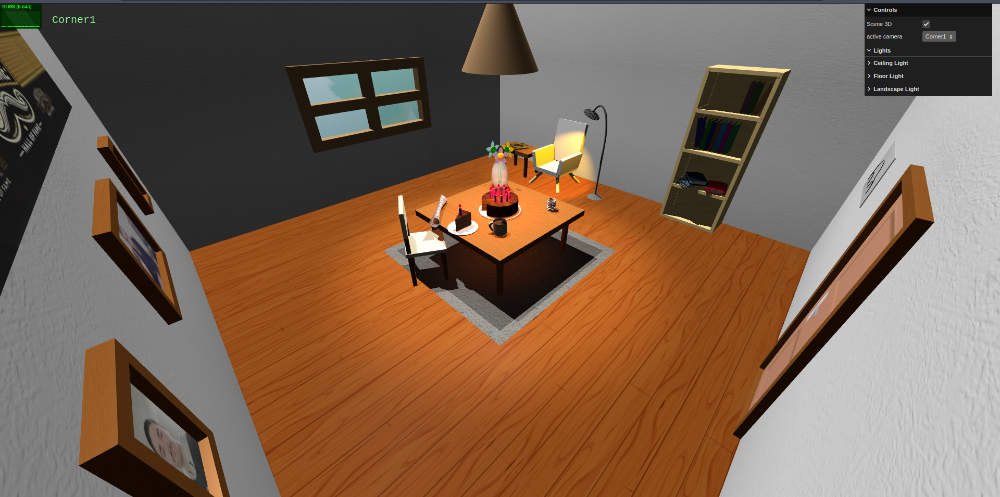
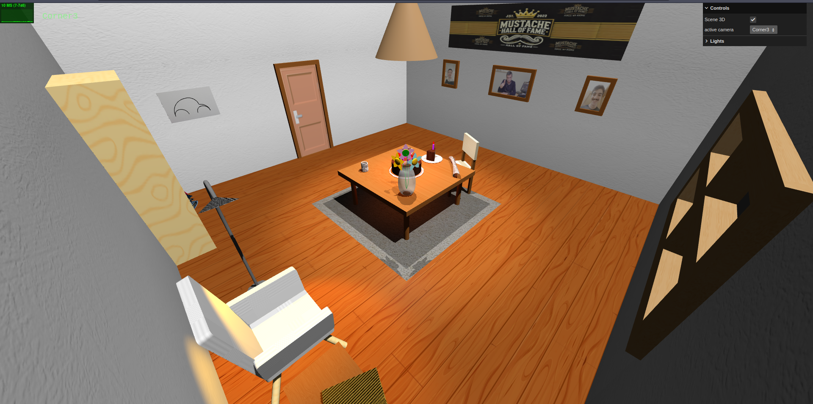
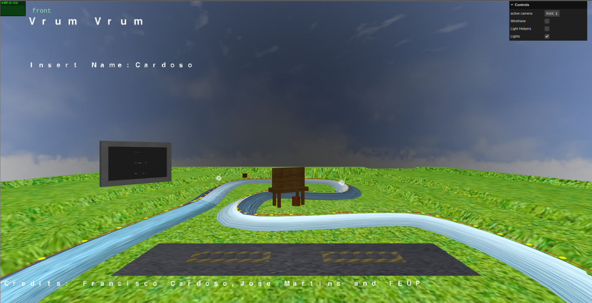
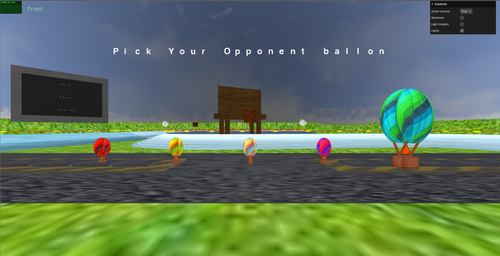
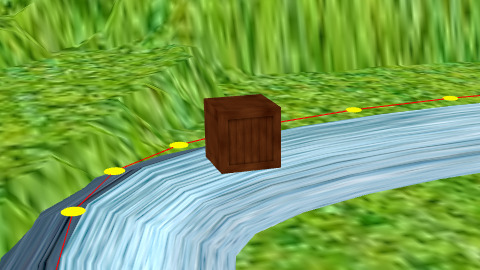
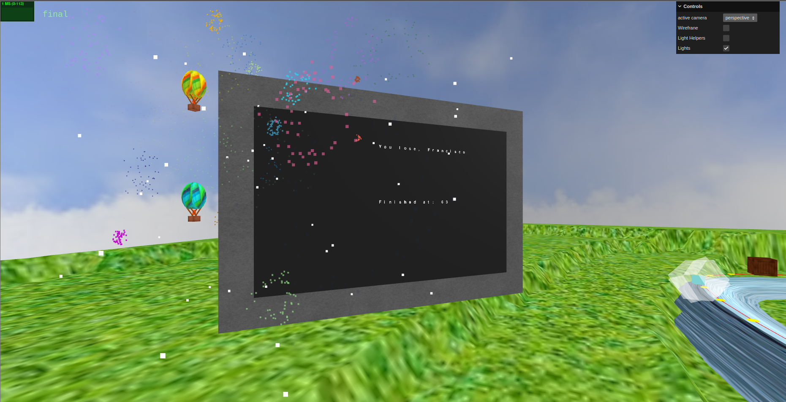

# SGI 2024/2025

## Group T05G02
| Name              | Number    | E-Mail             |
| ----------------- | --------- | ------------------ |
| Francisco Cardoso | 202108793 | up202108793@up.pt  |
| José Martins      | 202108794 | up202108794@up.pt  |

----

## Projects

## [TP1 - ThreeJS Basics](tp1)

### Project information

This project showcases an inviting, immersive 3D environment developed in three.js, designed with attention to detail to create a welcoming ambiance. Key highlights of the project include:

**Thoughtful Scene Composition**: The scene has been carefully arranged to evoke a comfortable and engaging atmosphere, with elements such as a bookshelf filled with books, a cake featuring a missing slice (a mandatory feature), and the missing slice itself positioned separately, adding a touch of realism. A sofa completes the scene, further enhancing the inviting setting.

**Varied Materials and Lighting Effects**: A diverse range of materials has been applied across different objects to enhance realism, allowing for unique lighting effects that add depth and texture to the scene, making it visually dynamic and engaging.

**Landscape with Parallax Effect**: The scene includes a landscape that employs a parallax effect, creating an illusion of depth and movement. Additionally, a point light acts as a representation of the sun, providing a natural glow and adding to the authenticity of the outdoor setting.

**Clean and Documented Code**: Emphasis was placed on writing clean, well-structured code, with comprehensive documentation throughout the project to ensure clarity and maintainability.

### Scene Overview

The scene features a central table adorned with a cake topped with candles—each with lights representing flames—alongside the missing slice on a separate plate, a newspaper, a spring, and a coffee mug. A chair is placed beside the table, which rests on a carpet, adding to the cozy setting. Nearby, a comfortable area includes a sofa, a bookshelf filled with books, and a smaller table with a book on top, enhancing the inviting atmosphere. Above, a ceiling light directs illumination onto the cake, while a floor light casts a warm glow toward the sofa. The walls add subtle details: one displays framed photos of the students and Professor Augusto, another has a window where sunlight enters, a third wall is left empty, and the final wall features a beetle and a door represented by an expanded frame with a door-like texture.

----
### Issues/Problems

**Code Structure and Abstraction**: Although we prioritized writing clear and well-organized code, there is some redundancy across files. Using abstract classes or factory patterns could improve structure and reduce repetition, resulting in a more streamlined codebase.

**Scene Expansion and Realism**: While we aimed to add more objects for enhanced realism, we focused on maintaining code cleanliness and overall clarity with the current elements.

**Double-Sided Geometry Bug**: We encountered visual artifacts with double-sided geometry, affecting the books and the top of the floor light. While this effect unexpectedly enhanced the books' appearance, we found it less desirable on the floor light. However, double-sided geometry was necessary for the intended visual effect.

**Memory Management and Performance**: We faced RAM overload issues, likely due to the extensive use of textures and shadows. To manage this, we limited the scene to three shadow-casting lights, balancing performance with visual quality, though the scene remains dense with objects.

-----

## [TP2 - YASF Parser](tp2)
### Project Information

This project showcases a recreation of Kratos' house from the game "God of War" in a Nordic setting, developed in threejs with YASF (Yet Another Scene Format). 
Key highlights of the scene include:

- **Nordic Setting**: The scene captures the essence of Kratos' house in the Nordic setting, with snowy terrain and wooden structures.
- **Clean Design**: The scene features clean and detailed design elements, such as the central hearth, wooden pillars, and beds from both Kratos and Atreus.
- **Atmospheric Lighting**: The scene features dynamic lighting effects to create an immersive ambiance, with a focus on the central hearth and surrounding environment.
- **Clean Code**: The scene is developed with clean and well-structured code, making it easy to understand and modify for future enhancements.

### Scene

A recreation of Kratos' house in its Nordic setting, including key elements like the central hearth, wooden pillars, and beds for Kratos and Atreus.
We have also included a table with a newspaper and a candle, which adds to the overall ambiance of the scene.
The whole building is based in the original game, with special attention to the size and proportions of the elements.
There is a official video behind the beds where Kratos is dancing with his son, Atreus, and a paint with the implemented mipmapping.
Finally, with the open roof and windows, we can see the snowy terrain outside the house. 

### Scene screenshots

---

### Issues/Problems

- **Missing Details**: Certain areas of the house, such as the workshop corner, need further refinement for small elements like tools and decorations.  
- **Performance**: Performance may be limited on devices with lower hardware specs due to high-resolution textures. 
- **Lighting**: Nighttime lighting effects are not yet fully adjusted to achieve the intended ambiance.  
- **Interactivity**: Interactive features, such as opening doors or lighting the hearth, have not been implemented yet.  

----

## [TP3 - Hot Air Ballon Race Game](tp3)
### Short Users Manual

You can find the [manual](./tp3/docs/SGI%20-%20Vrum%20Vrum.pdf) in the `docs` folder.

----
### Project Information

A simple yet fun hot air ballon race game. The scene is composed by a track an outdoor with an 3d ad, a screen that displays the race results and a parking lot for the balloons. The scene is completed with mountains powerups, obstacles and fireworks.
  
----
### Issues/Problems

- Couldn't implement the scoreboard
- It's really hard to control the balloons and to win the game
- We didn't manage to make the game run smoothly on all computers

### Screenshots

- 
- 
- 
- 
- 
- 

