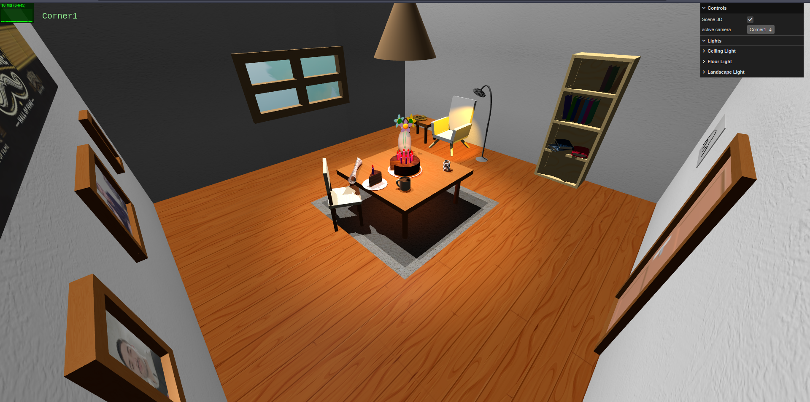
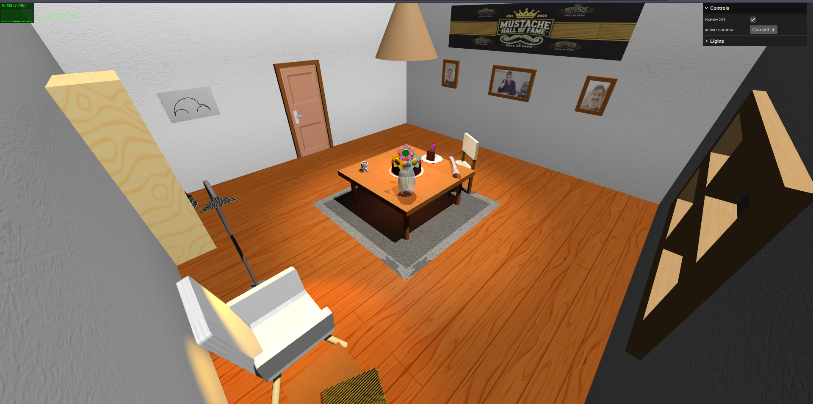
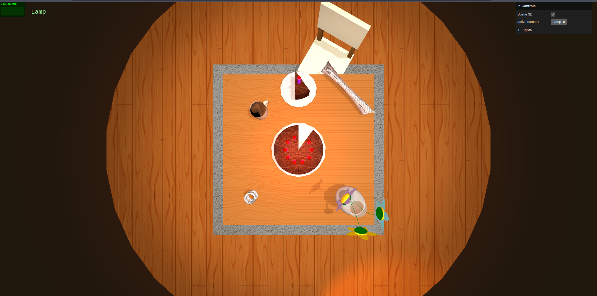

# SGI 2024/2025 - TP1

## Group: T05G02

| Name              | Number    | E-Mail             |
| ----------------- | --------- | ------------------ |
| Francisco Cardoso | 202108793 | up202108793@up.pt  |
| José Martins      | 202108794 | up202108794@up.pt  |

----
## Project information

This project showcases an inviting, immersive 3D environment developed in three.js, designed with attention to detail to create a welcoming ambiance. Key highlights of the project include:

**Thoughtful Scene Composition**: The scene has been carefully arranged to evoke a comfortable and engaging atmosphere, with elements such as a bookshelf filled with books, a cake featuring a missing slice (a mandatory feature), and the missing slice itself positioned separately, adding a touch of realism. A sofa completes the scene, further enhancing the inviting setting.

**Varied Materials and Lighting Effects**: A diverse range of materials has been applied across different objects to enhance realism, allowing for unique lighting effects that add depth and texture to the scene, making it visually dynamic and engaging.

**Landscape with Parallax Effect**: The scene includes a landscape that employs a parallax effect, creating an illusion of depth and movement. Additionally, a point light acts as a representation of the sun, providing a natural glow and adding to the authenticity of the outdoor setting.

**Clean and Documented Code**: Emphasis was placed on writing clean, well-structured code, with comprehensive documentation throughout the project to ensure clarity and maintainability.

### Scene Overview

The scene features a central table adorned with a cake topped with candles—each with lights representing flames—alongside the missing slice on a separate plate, a newspaper, a spring, and a coffee mug. A chair is placed beside the table, which rests on a carpet, adding to the cozy setting. Nearby, a comfortable area includes a sofa, a bookshelf filled with books, and a smaller table with a book on top, enhancing the inviting atmosphere. Above, a ceiling light directs illumination onto the cake, while a floor light casts a warm glow toward the sofa. The walls add subtle details: one displays framed photos of the students and Professor Augusto, another has a window where sunlight enters, a third wall is left empty, and the final wall features a beetle and a door represented by an expanded frame with a door-like texture.

----
## Issues/Problems

**Code Structure and Abstraction**: Although we prioritized writing clear and well-organized code, there is some redundancy across files. Using abstract classes or factory patterns could improve structure and reduce repetition, resulting in a more streamlined codebase.

**Scene Expansion and Realism**: While we aimed to add more objects for enhanced realism, we focused on maintaining code cleanliness and overall clarity with the current elements.

**Double-Sided Geometry Bug**: We encountered visual artifacts with double-sided geometry, affecting the books and the top of the floor light. While this effect unexpectedly enhanced the books' appearance, we found it less desirable on the floor light. However, double-sided geometry was necessary for the intended visual effect.

**Memory Management and Performance**: We faced RAM overload issues, likely due to the extensive use of textures and shadows. To manage this, we limited the scene to three shadow-casting lights, balancing performance with visual quality, though the scene remains dense with objects.

----
