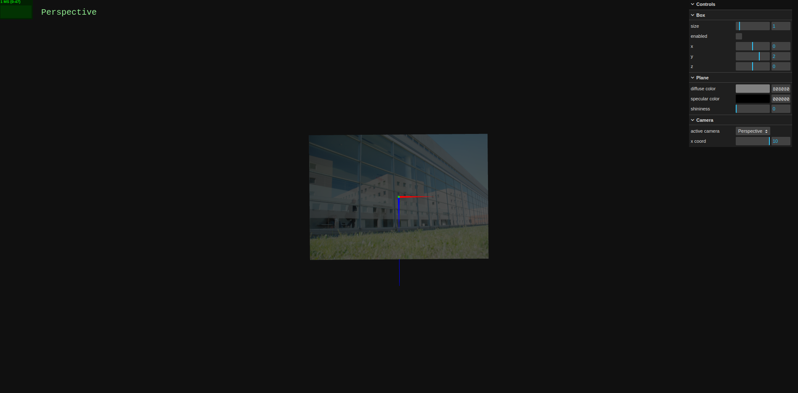
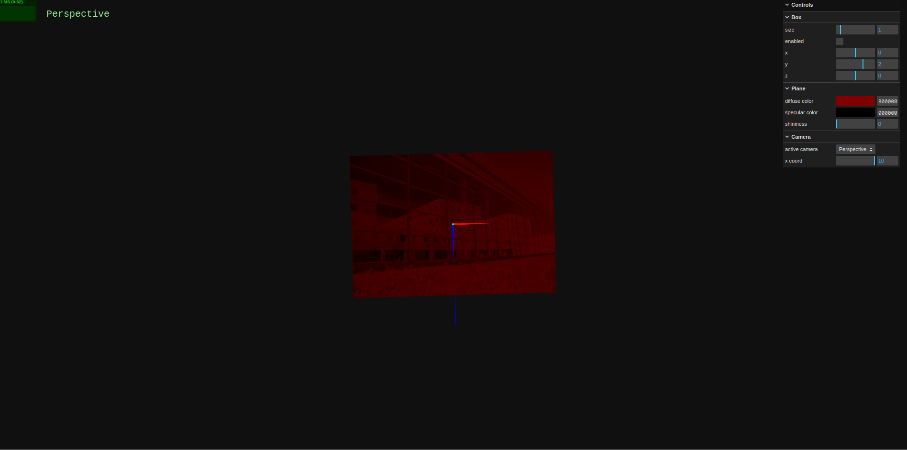
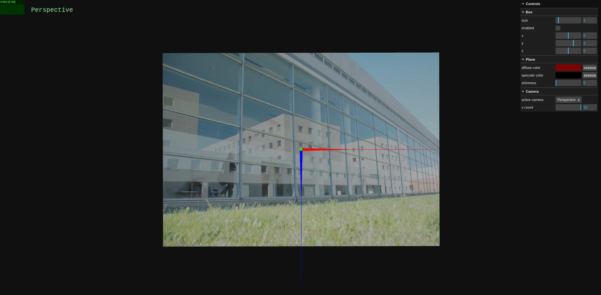
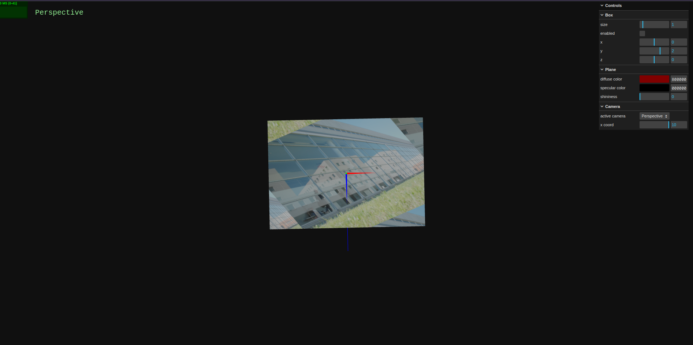

# SGI 2024/2025 - TP1

## Group: T0xG0y

| Name              | Number    | E-Mail             |
| ----------------- | --------- | ------------------ |
| Francisco Cardoso | 202108793 | up202108793@up.pt  |
| José Martins      | 202108794 | up202108794@up.pt  |

----
## Project information

- (items describing main strong points)
- Scene
  - (Brief description of the created scene)
  - (relative link to the scene)
----
## Issues/Problems

- (items describing unimplemented features, bugs, problems, etc.)
----

## Required Comments

#### 4.3.8 Materials & Textures Relationship

Initially, the image is influenced by the diffuse color of the plane, which is gray. The texture is applied on top of the plane, and it seems to be not affected by the diffuse color of the plane. This might be due to the fact that the texture has a gray nature, which makes it hard to distinguish the influence of the diffuse color of the plane.

After changing the diffuse light of the plane to red, the texture is still applied on top of the plane, but it is now clearly influenced by the red color of the plane. The texture is now red, which is a result of the combination of the diffuse color of the plane and the texture. It is still possible to see the texture and identify the shapes, but the color is now red.

However, after changing the material of the plane to a different one, the texture is not affected by the diffuse color of the plane, which makes it clear that the texture was influenced by the gray color in the first image. This is a good example of how the texture is influenced by the diffuse color of the plane, and how it can be influenced by the material of the plane.

#### 4.3.9 Wrapping of Textures - Scaling 

###### Before changing the planeSizeV 

> Does the texture image appear entirely on the plane?
Yes, the texture image appears to be entirely on the plane. However, since the planeTextureUVRate is not the same as the planeUVRate, the texture is cut off at the upper part of the plane. 

> Does the original length/width ratio of the texture in the image appear to be maintained?
Yes, the original length/width ratio of the texture in the image appears to be maintained, even though the texture is cut off at the upper part of the plane.

###### After changing the planeSizeV

> Does the texture image appear entirely on the plane?
Now it is clear that the texture image does not appear entirely on the plane. Since the planeTextureRepeatV is calculated based in the planeTextureUVRate, the texture is completely cut off at the upper part of the plane. 

> Does the original length/width ratio of the texture in the image appear to be maintained?
Yes. It's still maintained, and that's why the texture is cut off at the upper part of the plane.

###### Changing the planeTextureU to 2.5

>Check that, in each replica of the texture image, the length/width ratio is maintained. Justify...

The length/width ratio is maintained in each replica of the texture image because we defined the wrapping mode to be REPEAT. This means that the texture is repeated keeping the original length/width ratio of the texture image. This is why the texture is repeated in the U direction, but the length/width ratio is maintained in each replica of the texture image.

###### Changing to ClampToEdge

Now, the texture is not repeated. Instead, the last pixel of the texture is repeated. This means that the texture is not repeated, and the length/width ratio is not maintained in each replica of the texture image. 

###### Changing to MirroredRepeat

Finally, after changing the wrapping mode to MirroredRepeat, it's possible to check a similar behavior to the REPEAT mode. The difference is that the texture is mirrored in each replica of the texture image. This means that the length/width ratio is maintained in each replica of the texture image, but the texture is mirrored in each replica.

#### 4.3.11 Rotation of Textures

After changing the texture rotation, we can see that the texture is rotated around the  (0,0) point of the texture. However, if we change the center of the rotation, changing `planeTexture.center`, we can see that the texture is rotated around the new center. This is a good example of how the texture rotation works, and how it can be changed by changing the center of the rotation.

