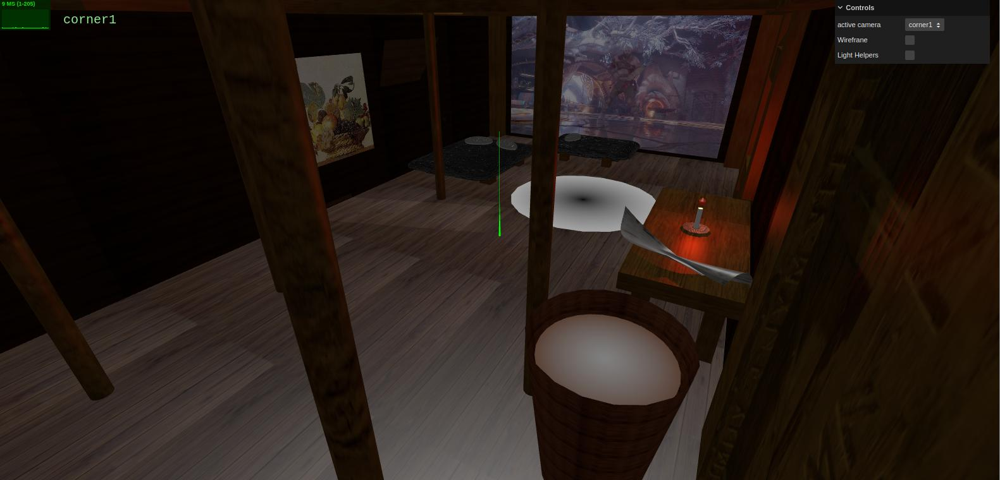
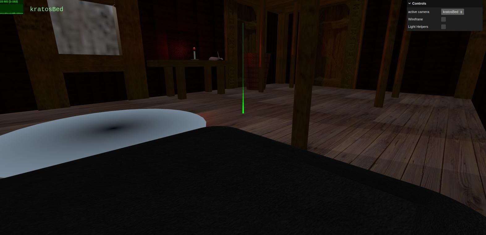

# SGI 2024/2025 - TP2

## Group: T05G02

| Name              | Number    | E-Mail             |
| ----------------- | --------- | ------------------ |
| Francisco Cardoso | 202108793 | up202108793@up.pt  |
| José Martins      | 202108794 | up202108794@up.pt  |

----
## Project Information

This project showcases a recreation of Kratos' house from the game "God of War" in a Nordic setting, developed in threejs with YASF (Yet Another Scene Format). 
Key highlights of the scene include:

- **Nordic Setting**: The scene captures the essence of Kratos' house in the Nordic setting, with snowy terrain and wooden structures.
- **Clean Design**: The scene features clean and detailed design elements, such as the central hearth, wooden pillars, and beds from both Kratos and Atreus.
- **Atmospheric Lighting**: The scene features dynamic lighting effects to create an immersive ambiance, with a focus on the central hearth and surrounding environment.
- **Clean Code**: The scene is developed with clean and well-structured code, making it easy to understand and modify for future enhancements.

### Scene

A recreation of Kratos' house in its Nordic setting, including key elements like the central hearth, wooden pillars, and beds for Kratos and Atreus.
We have also included a table with a newspaper and a candle, which adds to the overall ambiance of the scene.
The whole building is based in the original game, with special attention to the size and proportions of the elements.
There is a official video behind the beds where Kratos is dancing with his son, Atreus, and a paint with the implemented mipmapping.
Finally, with the open roof and windows, we can see the snowy terrain outside the house. 

### Scene screenshots

---

## Issues/Problems

- **Missing Details**: Certain areas of the house, such as the workshop corner, need further refinement for small elements like tools and decorations.  
- **Performance**: Performance may be limited on devices with lower hardware specs due to high-resolution textures. 
- **Lighting**: Nighttime lighting effects are not yet fully adjusted to achieve the intended ambiance.  
- **Interactivity**: Interactive features, such as opening doors or lighting the hearth, have not been implemented yet.  

--- 