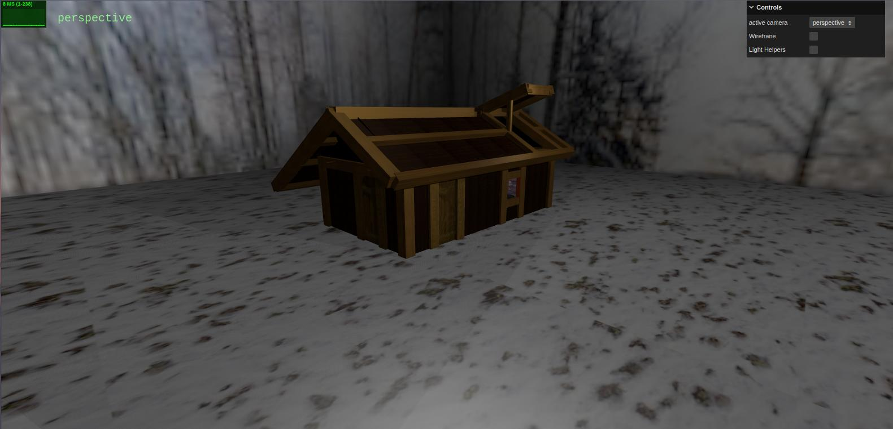
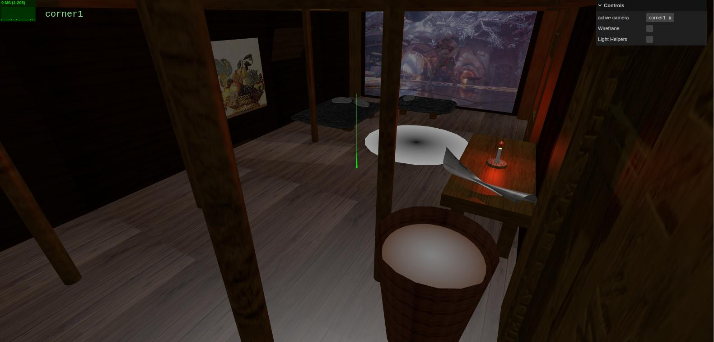

# SGI 2024/2025 - TP2

## Group: T05G02

| Name              | Number    | E-Mail             |
| ----------------- | --------- | ------------------ |
| Francisco Cardoso | 202108793 | up202108793@up.pt  |
| José Martins      | 202108794 | up202108794@up.pt  |

### Short Users Manual

You can find the [manual](SGI%20-%20Vrum%20Vrum.pdf) in the `docs` folder.

----
## Project Information

This project showcases a recreation of Kratos' house from the game "God of War" in a Nordic setting, developed in threejs with YASF (Yet Another Scene Format). 
Key highlights of the scene include:

- **Nordic Setting**: The scene captures the essence of Kratos' house in the Nordic setting, with snowy terrain and wooden structures.
- **Clean Design**: The scene features clean and detailed design elements, such as the central hearth, wooden pillars, and beds from both Kratos and Atreus.
- **Atmospheric Lighting**: The scene features dynamic lighting effects to create an immersive ambiance, with a focus on the central hearth and surrounding environment.
- **Clean Code**: The scene is developed with clean and well-structured code, making it easy to understand and modify for future enhancements.

### Scene

A recreation of Kratos' house in its Nordic setting, including key elements like the central hearth, wooden pillars, and beds for Kratos and Atreus.
We have also included a table with a newspaper and a candle, which adds to the overall ambiance of the scene.
The whole building is based in the original game, with special attention to the size and proportions of the elements.
There is a official video behind the beds where Kratos is dancing with his son, Atreus, and a paint with the implemented mipmapping.
Finally, with the open roof and windows, we can see the snowy terrain outside the house. 

### Scene screenshots

---

A simple yet fun hot air ballon race game. The scene is composed by a track an outdoor with an 3d ad, a screen that displays the race results and a parking lot for the balloons. The scene is completed with mountains powerups, obstacles and fireworks.
  
----
## Issues/Problems

- Couldn't implement the scoreboard
- It's really hard to control the balloons and to win the game
- We didn't manage to make the game run smoothly on all computers

### Screenshots

- 
- 
- 
- 
- 
- 
