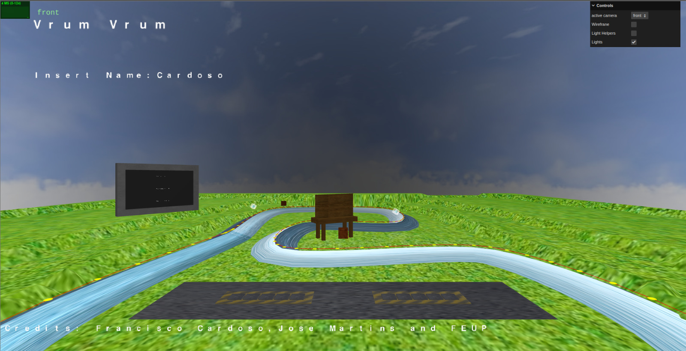
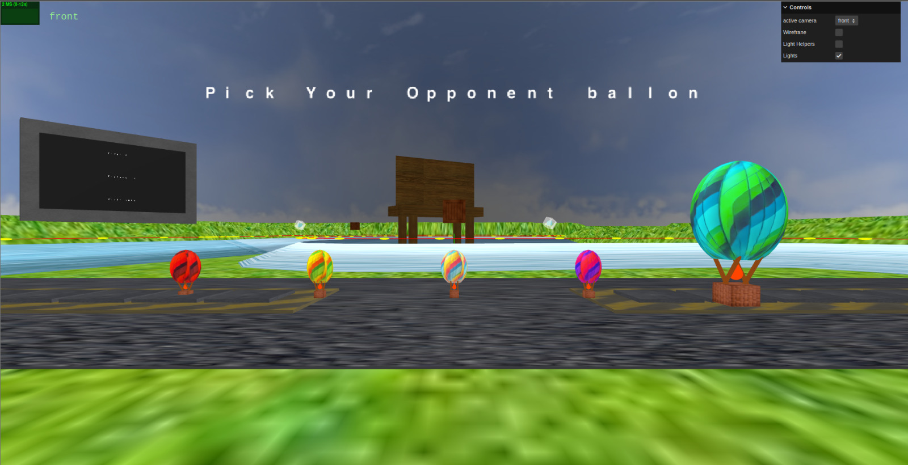
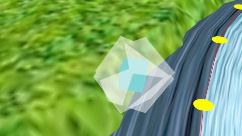
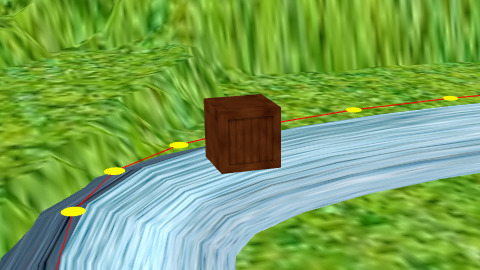
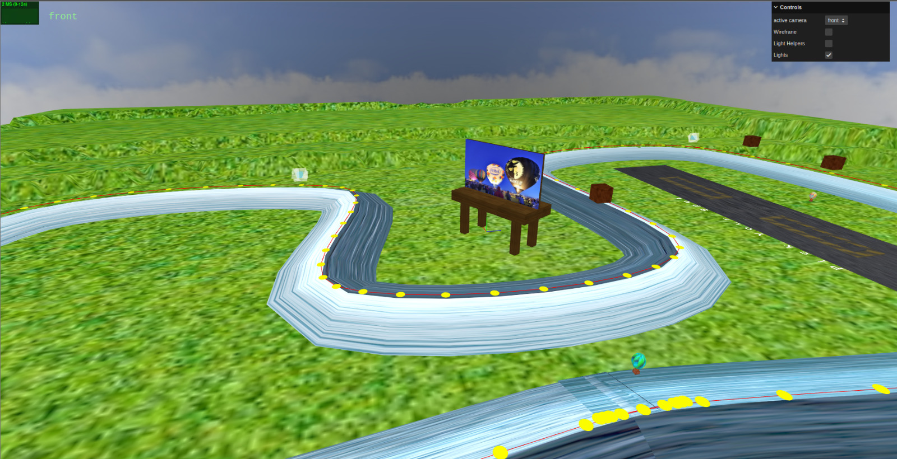

# SGI 2024/2025 - TP2

## Group: T05G02

| Name              | Number    | E-Mail             |
| ----------------- | --------- | ------------------ |
| Francisco Cardoso | 202108793 | up202108793@up.pt  |
| José Martins      | 202108794 | up202108794@up.pt  |

### Short Users Manual

You can find the [manual](SGI%20-%20Vrum%20Vrum.pdf) in the `docs` folder.

----
### Project Information

A simple yet fun hot air ballon race game. The scene is composed by a track an outdoor with an 3d ad, a screen that displays the race results and a parking lot for the balloons. The scene is completed with mountains powerups, obstacles and fireworks.
  
----
## Issues/Problems

- Couldn't implement the scoreboard
- It's really hard to control the balloons and to win the game
- We didn't manage to make the game run smoothly on all computers

### Screenshots

- 
- 
- 
- 
- 
- 
